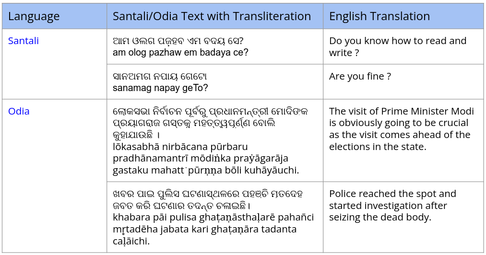
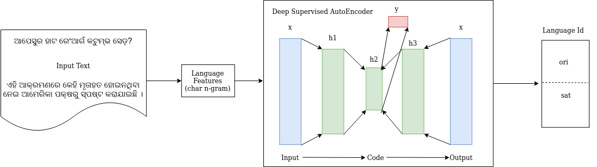

Overview
---------

The repository contains the Odia-Santali dialect detection data i.e. text written in Odia and Santali (using Odia script) as shown below. 

<p align="center">
  
</p>

Model
-------
The Supervised Autoencoder (SAE) used to build the model.

<p align="center">
  
</p>

The code is also available for detecting Odia and Santali.  


Dependency
----------

Python 3.6

PyTorch (torch=1.0.1, torchtext=0.4.0, torchvision=0.4.0)

Utilities (Skopt, sklearn, numpy, Zipfile, Pandas, Pickel) 

How to Run ?
-------------
The language detection code supports both CPU/GPU. For running in CPU/GPU mode, enable/disable the "is_gpu" flag to "True" or "False" inside the "lang_detect_santali.py" file. 

Usage: Execute the following command on the command line to run using CPU:
```
python lang_detect_santali.py
```

Result
-------
test set,pred,prob  
ଏତାଜ ଯାନବା ଆର ସେମେ ଓ଼ଜ଼ାଗ୍ରେ ସେଦାଗ ପେ ଦୋହ କବ?,1,13.880877  
ଜାଲି ହୋର,1,6.9847994  
ନେସ ଦାଗ ଯାଜ଼ି ସଡ଼ଲେକ ତାହେନ କାନ?,1,13.1231575  
ଏନେଇ ପୋଲିସ ଏକ ମାମଲା ରୁଜୁ କରି ଅଭିଯୁକ୍ତକୁ କୋର୍ଟ ଚାଲାଣ କରିଛି ,0,8.7072315  
ଖବର ପାଇ ପୁଲିସ ଘଟଣାସ୍ଥଳରେ ପହଞ୍ଚି ମୃତଦେହ ଜବତ କରି ଘଟଣାର ତଦନ୍ତ ଚଳାଇଛି,0,12.664953  
1947 ପରରୁ ହିଁ ପାକିସ୍ତାନର ହୀନ ଉଦ୍ଦେଶ୍ୟ ବିରୋଧରେ ଆମେ ସବୁ ମିଶି ଲଢ଼ିଆସୁଛି ,0,9.62458  
ଜାମ୍ମୁ କାଶ୍ମୀର ମୁଖ୍ୟମନ୍ତ୍ରୀ ମେହବୁବା ମୁଫତି ଓ ପିଡିପି ନେତା ଓମାର ଅବଦୁଲ୍ଲା ଘଟଣାକୁ ନିନ୍ଦା କରିଛନ୍ତି,0,9.312654  
ଏହି ତଥାକଥିତ ଗାନ୍ଧୀ ପରିବାର ଲାଭ ଛଡ଼ା ଅନ୍ୟ କିଛି ଚିନ୍ତା କରି ପାରନ୍ତି ନାହିଁ,0,12.284344  
ଆପେସୁର ହାଟ ଟିଏମ  ସେନଗ_ଏ?,1,14.650144  


Support/Contact
---------------
Please feel free to contact for any support or enhancement.


Reference Paper
---------------

[1] Parida, S., ú Villatoro-Tello, E., Kumar, S., Motlicek, P., & Zhan, Q. (2020). Idiap Submission to Swiss-German Language Detection Shared Task. In Proceedings of the 5th Swiss Text Analytics Conference (SwissText) & 16th Conference on Natural Language Processing (KONVENS).

[2] Le, L., Patterson, A., & White, M. (2018). Supervised autoencoders: Improving generalization performance with unsupervised regularizers. In Advances in Neural Information Processing Systems (pp. 107-117).

[3] Snoek, J., Larochelle, H., & Adams, R. P. (2012). Practical bayesian optimization of machine learning algorithms. In Advances in neural information processing systems (pp. 2951-2959).

Contributor
------------
- Sunil Sahoo
- Brojo Kishore Mishra
- [Shantipriya Parida](https://www.idiap.ch/~sparida/)
- [Satya Ranjan Dash](https://ksca.kiit.ac.in/profiles/satya-ranjan-dash/)
- Jatindra Nath Besra
- [Esau Villatoro-Tello](https://www.idiap.ch/~evillatoro/) 

Citation
--------

If you found our research helpful or influential please consider citing

@inproceedings{santali_dialect_detection,
  title={Automatic Dialect Detection for Low Resource Santali Language},
  author={Sahoo, Sunil and Mishra, Brojo Kishore and Parida, Shantipriya and Dash, Satya Ranjan and Besra, Jatindra Nath and {\'u} Villatoro-Tello, Esau},
  booktitle={Proceedings of the 19th OITS International Conference on Information Technology},
  year={2021}
}
